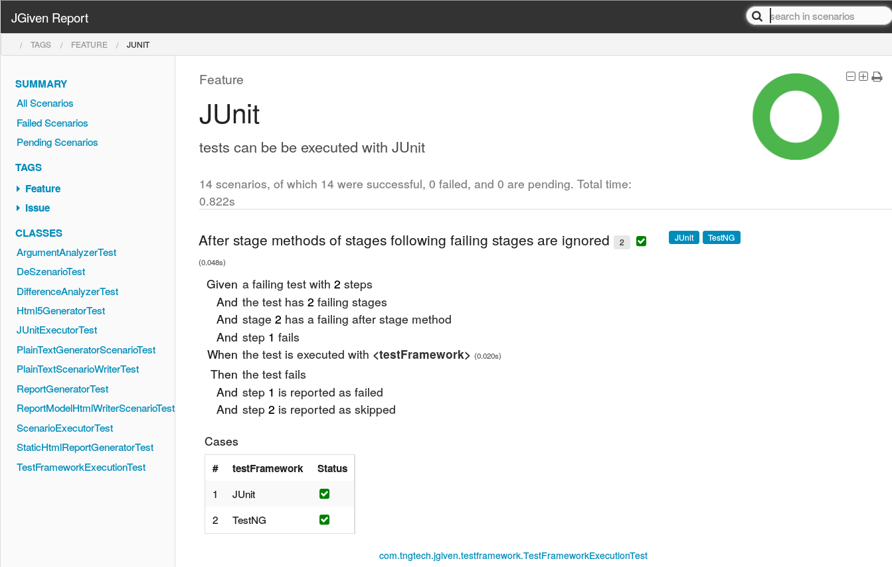

## Behavior-Driven Development in Plain Java

JGiven is a developer-friendly and pragmatic BDD tool for Java. Developers write scenarios in plain Java using a fluent, domain-specific API, JGiven generates reports that are readable by domain experts.

### News


<span class="post-date">{{ post.date | date: "%b %-d, %Y" }}</span> - <a class="post-link" href="{{ post.url | prepend: site.baseurl }}">{{ post.title }}</a>

### Example


@Test
public void a_pancake_can_be_fried_out_of_an_egg_milk_and_flour() {
    given().an_egg().
        and().some_milk().
        and().the_ingredient( "flour" );

    when().the_cook_mangles_everthing_to_a_dough().
        and().the_cook_fries_the_dough_in_a_pan();

    then().the_resulting_meal_is_a_pan_cake();
}


The above test can be executed like any JUnit test. During the execution, JSON files are generated that can then be used afterwards to generated test reports. By default, a plain text report is shown in the console, which would look as follows:

```
Scenario: a pancake can be fried out of an egg milk and flour

  Given an egg
    And some milk
    And the ingredient flour
   When the cook mangles everything to a dough
    And the cook fries the dough in a pan
   Then the resulting meal is a pan cake
```

Further examples can be found in the [jgiven-examples](https://github.com/TNG/JGiven/tree/master/jgiven-examples/src/test/java/com/tngtech/jgiven/examples) module of JGiven.

### HTML Report

Besides the plain text report, an HTML report can be generated. An example of such a report is [JGiven's own report]({{site.baseurl}}/jgiven-report/html5):
<p>
<a href="{{site.baseurl}}/jgiven-report/html5"></a>
</p>
The source code of the corresponding JGiven tests are in the [jgiven-tests](https://github.com/TNG/JGiven/tree/master/jgiven-tests) module of the JGiven project.

### Key facts

* Scenarios are written in plain Java with a _fluent_ Java API - Neither text files, nor Groovy is needed
* Method names are *parsed at runtime* and define the scenario text - No duplicate text in annotations is needed
* Scenarios are executed by either *JUnit* or *TestNG* - No extra test runner is needed, thus JGiven works with all existing IDEs and build tools for Java out-of-the-box
* Scenarios are composed of multiple, *reusable* so-called Stage classes - No more test code duplication
* Scenarios and steps can be parameterized for writing *data-driven* tests
* JGiven generates HTML reports that can be read and understand by domain experts and serve as a *living documentation*


### Talk on JGiven at BigTechday 8

Jan Schäfer gave a talk on JGiven at the BigTechday 8. It explains the rational behind JGiven and gives an introduction into the main features of JGiven.

<iframe class="shadow-frame" width="560" height="315" src="https://www.youtube.com/embed/gh_yjb3x8Yc" frameborder="0" allowfullscreen></iframe>
